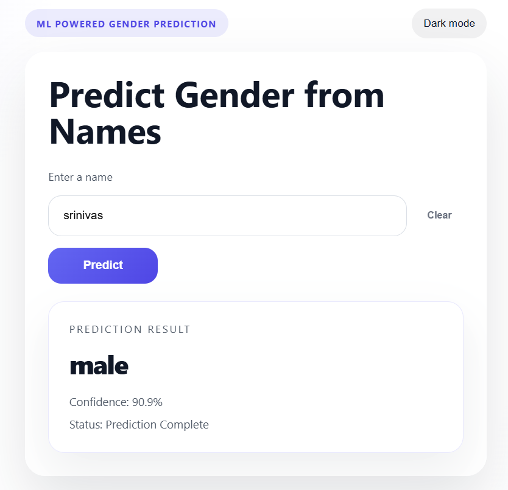

# Gender Prediction Using Machine Learning

A Machine Learning web application that predicts a person's gender from their first name using character-level text classification. The project includes a Flask web interface, REST API, and command-line prediction support.

## Application Preview



---

## Features

* Gender prediction from names
* Machine Learning classification model
* Flask web application
* REST API support
* Command-line prediction
* Confidence score display
* Responsive user interface
* Dark mode support

---

## Tech Stack

* Python
* Scikit-Learn
* Pandas
* Flask
* HTML
* CSS
* JavaScript
* Joblib

---

## Workflow

```text
Dataset
   ↓
Data Preprocessing
   ↓
Feature Extraction
   ↓
Model Training
   ↓
Model Evaluation
   ↓
Gender Prediction
   ↓
Flask Web Application
```

---

## Installation

```bash
pip install -r requirements.txt
```

---

## Train the Model

```bash
python src/train.py
```

Generated Files:

* models/gender_name_clf.joblib
* outputs/confusion_matrix.png
* outputs/classification_report.txt

---

## Run the Application

```bash
python src/app.py
```

Open in your browser:

```text
http://127.0.0.1:5000
```

---

## Predict from Terminal

```bash
python src/predict.py "sneha"
```

Example Output:

```text
Predicted Gender: Female
Confidence Score: 95%
```

---

## API Usage

### Endpoint

```http
POST /api/predict
```

### Request

```json
{
  "name": "sneha"
}
```

### Response

```json
{
  "predicted_gender": "female",
  "confidence": 0.95
}
```

---

## Applications

* Name-Based Gender Classification
* Machine Learning Projects
* Flask API Development
* Data Science Portfolio Project

